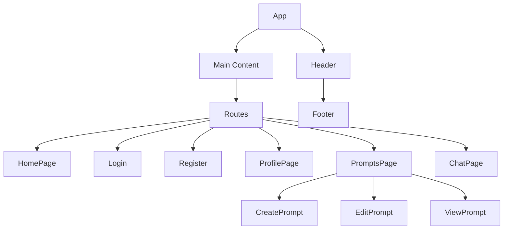
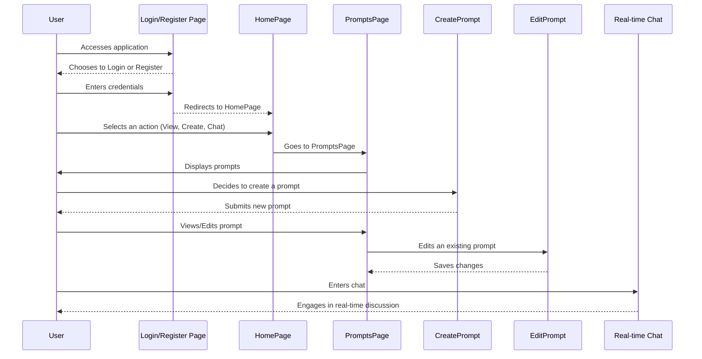

# Overview

# Detailed Documentation for React Application - PromptPro

## Table of Contents
1. [Introduction](#introduction)
2. [Application Functionality and Purpose](#functionality-and-purpose)
3. [Architecture and Design Patterns](#architecture-and-design)
4. [Key Algorithms and Data Structures](#algorithms-and-data-structures)
5. [Troubleshooting and Common Errors](#troubleshooting-and-errors)
6. [Best Practices and Coding Standards](#best-practices)
7. [Diagrams and Flowcharts](#diagrams-and-flowcharts)

---

## Introduction
This documentation provides a comprehensive overview of the PromptPro application, which is built using React and designed for managing user-generated prompts. The application includes features such as user authentication, prompt management, and real-time chat functionalities.

---

## Application Functionality and Purpose
### Overview
PromptPro serves as a platform where users can create, view, edit, and categorize prompts. It includes user management capabilities allowing for user registration, login, and profile editing. The application is designed to foster user interaction and content management through a clean and responsive web interface.

### Core Features
- **User Authentication**: Secure registration and login process.
- **Prompt Management**: Users can create, edit, and delete prompts.
- **Category Management**: Prompts can be categorized for better organization.
- **Real-Time Chat**: Live chat feature for user interaction.
- **Profile Management**: Users can view and edit their profile details.

---

## Architecture and Design Patterns
### Component Structure
The application adopts a modular component structure facilitating reuse and maintenance. React Router is used for handling navigation and routing within the application.

### State Management
State management is handled locally within components using React's useState and useEffect hooks. This approach simplifies state management without the need for external libraries.

### Design Patterns
- **Container/Presentational Components**: Separation of logic and presentation to enhance reusability.
- **Higher-Order Components (HOC)**: Used for features like user authentication to wrap protected routes.

---

## Key Algorithms and Data Structures
### Filtering Algorithm
Prompts are filtered based on categories and user ownership. This is implemented using array filtering techniques where prompts are matched against selected criteria.

### Data Handling
Data fetching and manipulation are handled using asynchronous JavaScript (async/await), interacting with a simple REST API for CRUD operations.

---

## Troubleshooting and Common Errors
### Common Issues
- **Login Failures**: Often caused by incorrect user credentials or server issues.
- **Data Fetching Errors**: Network issues or incorrect endpoints can lead to failed data fetching operations.

### Troubleshooting Steps
1. **Check Console**: Review console logs in the browser to identify JavaScript or network errors.
2. **Network Requests**: Use the browser's network tab to monitor and review HTTP request statuses and responses.

---

## Best Practices and Coding Standards
### Code Style
- **Indentation**: Consistent use of 2 spaces for indentation.
- **Naming Conventions**: CamelCase for variables and functions, PascalCase for component names.
- **Code Comments**: Use comments to explain "why" something is done, not "what" is done.

### Performance Optimization
- **Code Splitting**: Use React.lazy for dynamic imports to split code and reduce initial load time.
- **Memoization**: Use React.memo and useCallback to prevent unnecessary re-renders.

---

## Diagrams and Flowcharts

**Component Structure Flowchart**

**Mermaid Flowchart:**

These diagrams provide visual insights into the structure and user flow of the PromptPro application, helping developers and new users alike understand how components interact and how users navigate through the system.

This detailed documentation aims to provide all necessary information for developers working on the PromptPro application, ensuring ease of maintenance and scalability.