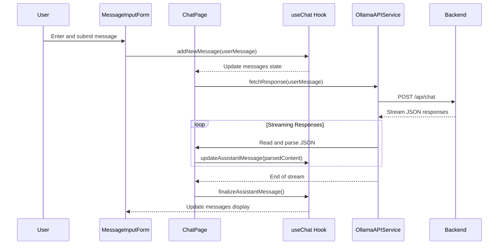
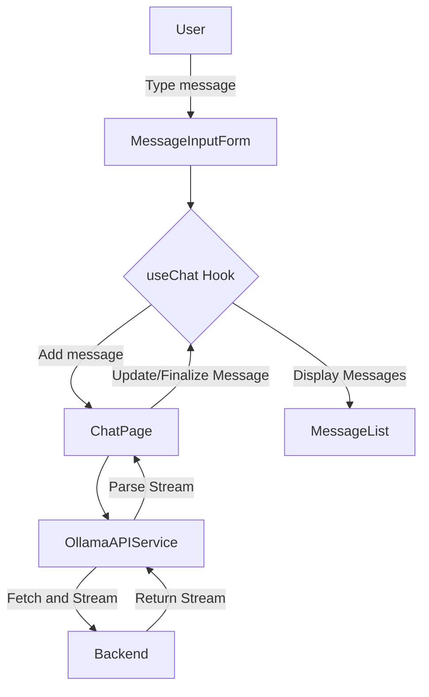

The chat feature in the application is a robust module that allows real-time communication between the user and an AI assistant. Here's a detailed breakdown of how the chat functionality is structured, including the interaction of the custom hook, JSON parsing, and streaming.

### Overview of Chat Components and Services
1. **ChatPage Component**: This is the main component for the chat feature. It manages the chat UI and coordinates the interactions between the user input, message display, and backend communication.

2. **useChat Hook**: A custom React hook that encapsulates the logic for managing the state and behavior of chat messages. It handles adding new messages, updating assistant messages, and finalizing messages once they are complete.

3. **MessageList Component**: Displays the list of messages. It subscribes to the messages state from the `useChat` hook.

4. **MessageInputForm Component**: Handles user input for sending new messages. It interacts with `useChat` to dispatch new messages.

5. **OllamaAPIService**: Contains the `fetchResponse` function which sends user messages to the backend and receives streamed responses.

### Detailed Flow of Chat Feature
1. **User Input**: When a user types a message and submits it via the `MessageInputForm`, the `handleFormSubmit` function is triggered. This function uses the `addNewMessage` method from `useChat` to add the user's message to the state.

2. **Sending to Backend**: After adding the user's message, `ChatPage` triggers a fetch request by calling `fetchResponse` from `OllamaAPIService`. This function sends the user's message to the backend and returns a stream reader.

3. **Streaming Response**: The backend processes the message and starts streaming responses. The `ChatPage` reads from the stream using the reader returned by `fetchResponse`. It reads the stream continuously until the backend indicates that no more data is coming (`done` property of the reader's result is `true`).

4. **JSON Parsing**: As chunks of data are received from the stream, they are concatenated until a newline character is detected. This indicates that a complete JSON message has been received. The data before the newline is parsed as JSON, and any valid messages are used to update the assistant's ongoing message in the state using `updateAssistantMessage` from `useChat`.

5. **Updating UI**: Once the final chunk of data is received and processed, the `finalizeAssistantMessage` method from `useChat` is called to finalize the assistant's message in the UI.

6. **Display Messages**: Throughout this process, the `MessageList` component listens to updates in the messages array from `useChat` and re-renders to show new or updated messages in the UI.

### Mermaid Sequence Diagram for Chat Interaction

### Mermaid Flow Diagram for Chat Components and Data Flow

This sequence and flow diagram should provide a clear visualization of how the chat functionality is designed and how data flows between components and services in the application.