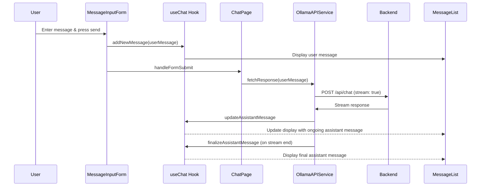

Certainly! Here's a detailed document that tracks the flow of data from the moment a user presses the "send" button in the chat feature to when the incoming assistant message is displayed. This documentation will include the interaction between the front-end components and the back-end service.

### Detailed Flow: From Send Button to Displaying Assistant Message

#### 1. **User Interaction**
   - **Action**: The user types a message in the `MessageInputForm` and presses the "send" button.
   - **Component**: `MessageInputForm.jsx`
   - **Functionality**: The form captures the input through a controlled component tied to a state that updates on each keystroke.

#### 2. **Submitting the Form**
   - **Action**: The form's onSubmit event handler `handleFormSubmit` is triggered.
   - **Component**: `MessageInputForm.jsx`
   - **Functionality**: `handleFormSubmit` prevents the default form submission behavior to handle the submission asynchronously. It validates that the input is not empty and calls the `useChat` hook's `addNewMessage` method.

#### 3. **Updating State with New Message**
   - **Action**: The user's message is added to the state.
   - **Hook**: `useChat.js`
   - **Functionality**: `addNewMessage` updates the chat messages state to include the new user message. This update triggers a re-render of the `MessageList`, but since the assistant's response hasn't been fetched yet, only the user's message is displayed.

#### 4. **Sending Message to Backend**
   - **Action**: After adding the user's message to state, `ChatPage` invokes `fetchResponse` from `OllamaAPIService`.
   - **Component/Service**: `ChatPage.jsx` / `OllamaAPIService.jsx`
   - **Functionality**: `fetchResponse` sends the user's message to the server via a POST request. It uses the Fetch API to handle the POST request and initiates streaming by setting the `stream` option to `true`.

#### 5. **Handling Streamed Response**
   - **Action**: The server processes the message and streams the response back.
   - **Service**: `OllamaAPIService.jsx`
   - **Functionality**: As chunks of data arrive, `fetchResponse` processes these chunks incrementally. It reads the response stream using a `ReadableStreamDefaultReader`.

#### 6. **Processing Incoming Data**
   - **Action**: Data chunks are concatenated until complete JSON messages are delimited by newline characters.
   - **Service**: `OllamaAPIService.jsx`
   - **Functionality**: Each complete JSON message is parsed and the resulting object is checked for the `message` key containing the assistant's response.

#### 7. **Updating Assistant Message in State**
   - **Action**: Parsed messages update the ongoing assistant message.
   - **Hook**: `useChat.js`
   - **Functionality**: `updateAssistantMessage` is called with the content of the assistant's message, concatenating it to any previous part of the message if the message is being built up over multiple chunks.

#### 8. **Finalizing the Assistant Message**
   - **Action**: Once the stream is completed (the backend sends a signal that no more data will be sent), the message is finalized.
   - **Hook**: `useChat.js`
   - **Functionality**: `finalizeAssistantMessage` clears any temporary or ongoing message state, ensuring the assistant's full message is now static and displayed.

#### 9. **Displaying the Message**
   - **Component**: `MessageList.jsx`
   - **Functionality**: With the state updated by `useChat`, `MessageList` re-renders to include all messages in the correct order. It uses a `ref` to ensure the view automatically scrolls to show the newest messages, maintaining focus on the most recent interactions.

### Sequence of Events Diagram

For a clearer visual representation, here's how the events are sequenced:

This detailed flow and sequence diagram should provide a comprehensive understanding of the chat functionality, from user interaction to backend processing and final message display.