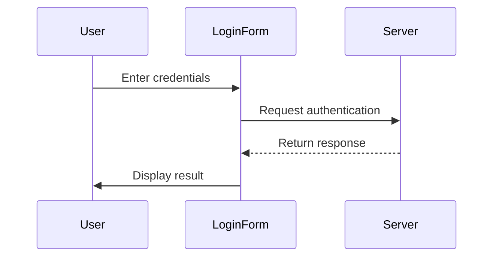
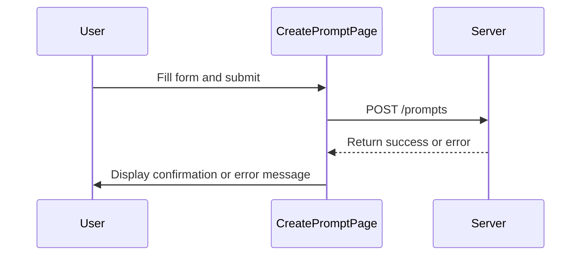
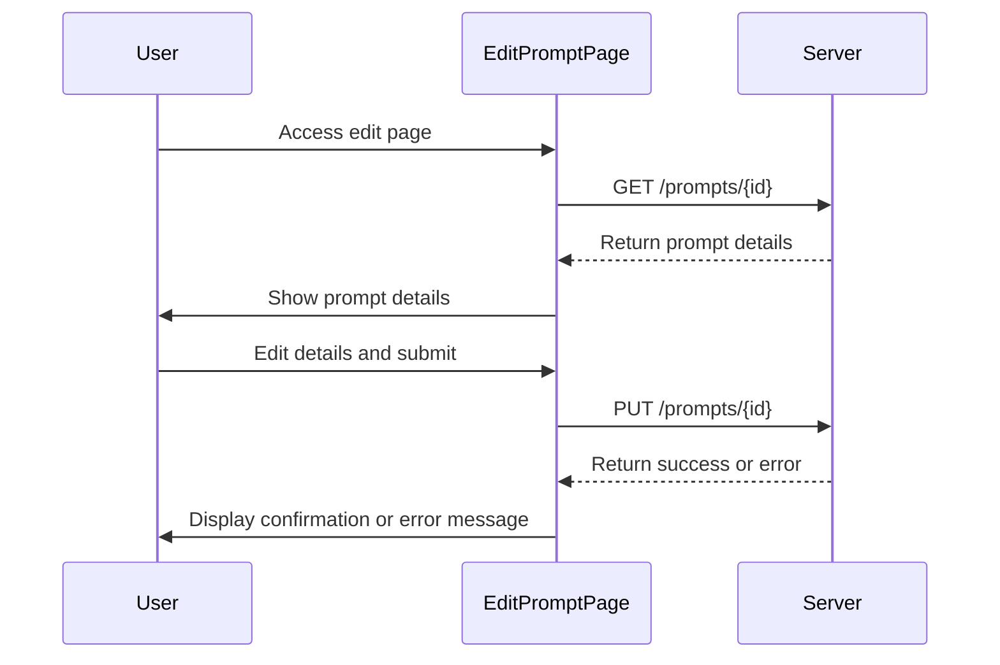
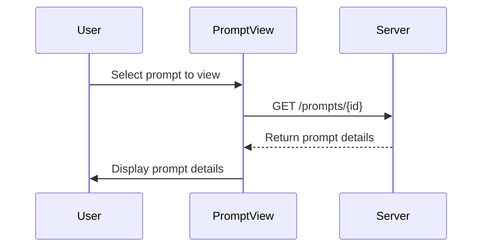
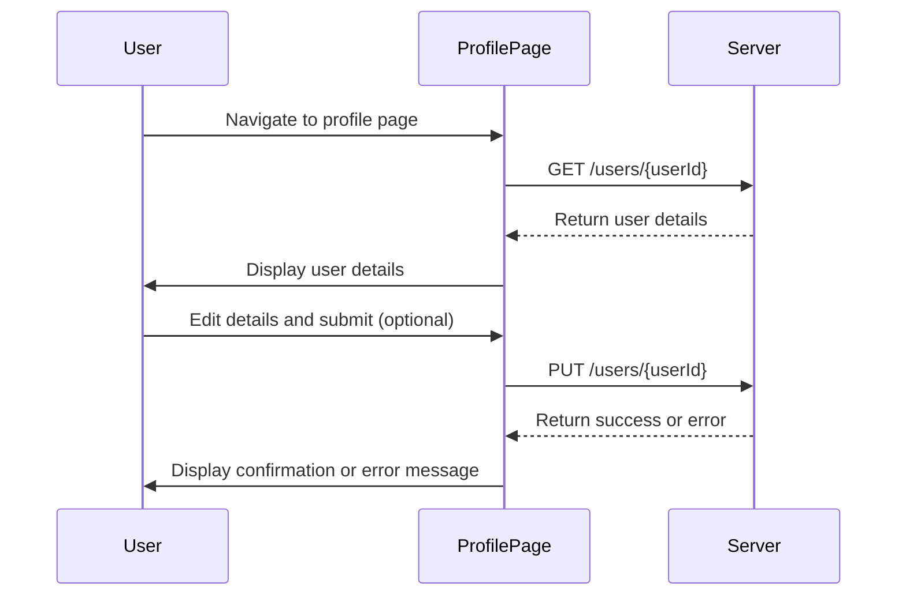
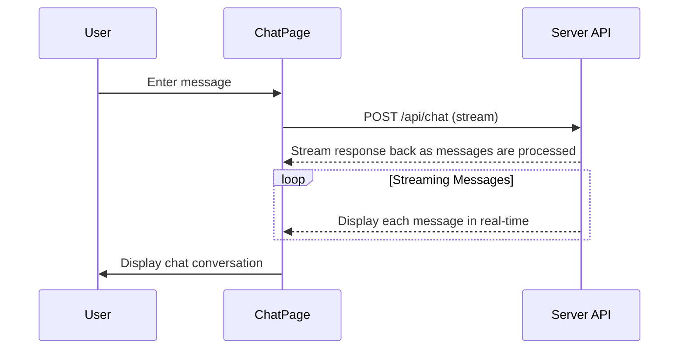

~Below are Mermaid diagrams depicting the sequence and interactions for different aspects of the PromptPro application, including the creation, editing, and viewing of prompts, as well as profile management and chat functionalities.

## Login Process Sequence

### Sequence Diagram for Creating a Prompt

### Sequence Diagram for Editing a Prompt

### Sequence Diagram for Viewing a Prompt

### Sequence Diagram for User Profile Management

### Sequence Diagram for Real-Time Chat

These diagrams collectively visualize the main workflows within the PromptPro application, highlighting the interactions between the user, the front-end components, and the server. They serve as a useful guide for understanding the flow of data and user interactions across the system.